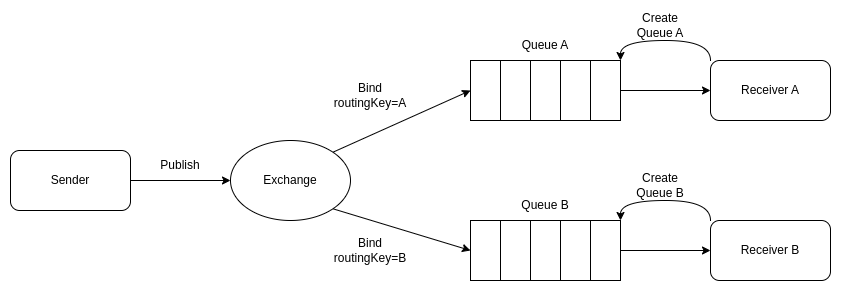

# Projeto de exemplo para comunicação com protocolo AMQP

## Introdução

Esse projeto possui 3 aplicações Java, sendo elas:

- sender: aplicação que recebe mensagens via requisição http e publica elas em um exchange.
- receiver-a: aplicação que recebe mensagens de uma queue.
- receiver-b: aplicação que recebe mensagens de uma queue.

Aqui é utilizado o conceito de Direct Exchange onde a aplicação sender envia mensagens para um exchange e informa uma 
routingKey, que é utilizada para direcionar as mensagens desse exchange para suas devidas filas.

Diagrama da comunicação com protocolo amqp usando direct exchange:



Mais referências sobre o conceito de exchange e queues segue a [documentação do rabbitmq](https://www.rabbitmq.com/tutorials/tutorial-four-spring-amqp.html).

## Subindo as aplicações

Pré requisitos:

- Maven
- Java 17+

Acesse o diretório de cada subprojeto (sender, receiver-a e receiver-b) e:

- instale as dependências com `mvn clean install`
- execute o projeto com `mvn spring-boot:run`

## Funcionamento

Para enviar uma mensagem aos receivers, basta enviar uma requisição http para a aplicação sender seguindo o padrão:

```shell
curl --request POST \
  --url http://localhost:3001/messages \
  --header 'Content-Type: application/json' \
  --data '{
	"from": "Fulano",
	"to": "receiver-a",
	"message": "Mensagem de teste 123"
  }'
```

Onde o parâmetro `to` é a routingKey que determina se a mensagem vai para a fila do receiver-a ou receiver-b.

Nos respectivos consoles de cada aplicação é exibido quando a mensagem é enviada e recebida.